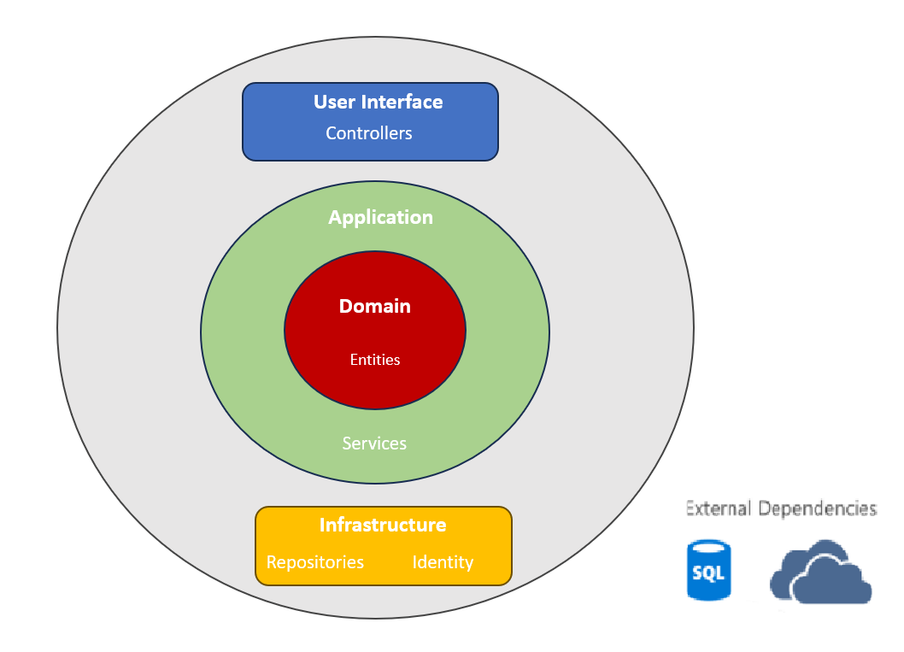

# Medical-Appointment-Scheduling-System
O MedicalSystem engloba o desenvolvimento de uma API web para um sistema de agendamento de consultas utilizando Onion Architecture (Clean Architecture) com autenticação/autorização através do identity framework e execução de teste de unidade com XUnit. O projeto em si contém uma aplicação Web API desenvolvida em ASP.NET 7 , na qual, é responsável por toda a lógica da aplicação e comunicação com o banco de dados. Além do mais, conta com um sistema de notificação via email para os pacientes que possuem consulta agendada.Por fim, o projeto também possui um pipeline de integração e entrega contínua (CI/CD) no Github Actions, de modo de automatizar o processo de implantação de ponta a ponta com testes de unidade e deploy.

## Requisitos Funcionais e não funcionais:
1. Os(as) pacientes devem ser capazes de criar e gerenciar contas 
pessoais.
2. Os(as) pacientes devem ser capazes de agendar, reagendar ou cancelar 
consultas.
3. Os(as) médicos(as) devem ser capazes de visualizar e gerenciar suas 
agendas de consultas.
4. Deve haver um sistema de notificação para lembrar pacientes de suas 
consultas. Estas notificações podem ser via e-mail.
5. A Api deve conter um fluxo de delete lógico não físico.
6. Testes unitários

## Arquitetura padrão utilizada

Confome dito acima, foi utilizado o padrão de arquitetura cebola também chamada de arquitetura limpa. A arquitetura "cebola" é um conceito de design para sistemas de software que enfatiza camadas de abstração e isolamento. Inspirada em uma cebola com várias camadas, cada camada representa um nível de funcionalidade e depende das camadas internas para funcionar. Isso promove a modularidade, reusabilidade e manutenção do sistema, permitindo que cada camada se concentre em uma responsabilidade específica. Uma jeito comum de visualizar essa arquitetura é através de uma série de circulos concentricos similares a uma cebola conforme pode ser visto na imagem abaixo :



Por tanto a estrutura do projeto ficou dividido conforme demonstrado abaixo:

    ```
    |--docs - Documentação e diagramas
    |--src
      |-- MedicalSystem.Api - A camada de interface do usuário e comunicação externa. Ela recebe solicitações e fornece respostas, atuando como ponto de entrada para interações com o sistema.
      |-- MedicalSystem.Application - A camada de interface do usuário e comunicação externa. Ela recebe solicitações e fornece respostas, atuando como ponto de entrada para interações com o sistema e possui a implementação dos use cases.
      |-- MedicalSystem.Domain - A camada de domínio encapsula as regras centrais e a lógica de negócios da aplicação. Ela modla eos conceitos fundamentais e as relações do problema que a aplicação está resolvendo.
      |-- MedicalSystem.Infrastructure - Responsável pelo acesso e gerenciamento dos dados da aplicação. Isso inclui interações com bancos de dados, armazenamento de informações e operações relacionadas.Além do mais,  ela lida com aspectos de autenticação e autorização dos usuários. É responsável por gerenciar a identidade dos usuários e suas permissões
      |-- MedicalSystem.Test - Esta camada se refere a parte dos testes unitários do projeto. É Nela, são realizados todos os testes de unitários para verificar regressões na aplicação.
    ```

Abaixo é possível verifica a arquiterura das classes da aplicação:

Abaixo é possível verificar a arquitetura da Applicação no Azure:


O projeto contem um Container Web App que é alimentado pelo arquivo de docker-compose da aplicação. Onde esse arquivo é composto por uma instância de uma imagem gerada a partir do build da aplicação contida nesse repositório através do continuos integration e uma container do sql-server. A imagem da aplicação pode ser obtita a partir do link `docker.io/caiotmello/medicalsystemapi:latest` que está amarzenada no docker hub.

O container da aplicação é conectado com o container do sql para armazenar os dados da API como os usuários,pacientes, doutores e agendamentos. Podendo assim, fazer todo o controle de usuários e agendamentos do sistema.

Para conexão com o banco de dados foi utilizado Entity Framework Core e desenvolvido o CRUD com Repository pattern que pode ser encontrado sua implementação na camada de Infraestrutura. Design do banco de dados:


O banco de dados conta com as tabelas descritas acima mais as tabelas geradas para o controle de autenticação e autorização de usuáridos do IDENTITY Framework.

## CI/CD

Esse projeto possui um pipeline de integração e entrega continua (CI/CD) com gitbuh action , de modo de automatizar o processo. O fluxo desse processo pode ser visto na imagem abaixo:


1. O desenvolvedor faz um push para o repositório do github na branch master.
2. O pipeline do GitHub Actions é iniciado.
3. Inicia-se o processo de build do projeto.
4. É feito os teste unitários.
5. Após o termino é criado uma imagem de container com o resultado do build.Essa nova imagem é carregada no Docker Hub.
6. Com a nova imagem no ACR, é feito o deploy da mesma em um Web Web For Container através do arquivo de docker-compose.
7. API atualizada e disponibilizada para o usuário.

## Aplicação

O Projeto não possue front end, sendo assim, foi disponibilizado somente os endpoint para comunicação através de alguma ferramente de mercado que faça requisições HTTP ou swagger.
São disponibilizados 4 endpoints na api: Patient, Doctor, Appointment and  User, sendo que para utilizar os três primeiros endpoints é necessário estar autenticado na API com JWT.
Então para qualquer requisição que for feita nesses três endpoints (Patient,Doctor e Appointment) é necessário enviar no header da requisição um Bearer Token que será disponibilizado ao autenticar o usuário no endpoint `/api/v1/users/register`.

Para fazer o cadastro de um appoitment é necessário antes de criado pelo menos um paciente e um doutor para ser enviada na requisição.

### URL de Acesso

Para testar a API sem ter que criar toda a infraestrutura, estou disponibilizando as URLs de acesso temporariamente nos links abaixo:

1. URL `https://medicalsystemfiap.azurewebsites.net/api/v1/<Colocar_final_endpoint>` para acesso com Postman , etc.
2. URL `https://medicalsystemfiap.azurewebsites.net/swagger/index.html` para acesso via Swagger.

### Métodos

Requisições para a API devem seguir os padrões:
| Método | Descrição |
|---|---|
| `GET` | Retorna informações de um ou mais registros. |
| `POST` | Utilizado para criar um novo registro. |
| `PUT` | Atualiza dados de um registro ou altera sua situação. |
| `DELETE` | Remove um registro do sistema. |

### Respostas

| Código | Descrição                                                          |
| ------ | ------------------------------------------------------------------ |
| `200`  | Requisição executada com sucesso (success).                        |
| `201`  | Criação o objeto com sucesso.                                      |
| `400`  | Erros de validação ou os campos informados não existem no sistema. |
| `401`  | Usuário não autorizado.                                            |
| `500`  | EndPoint não encontrado,                                           |

### Controller [/users]

Reponsável pelo controle de usuário e autenticação da API. Nele é onde será feito a criação do usuário e recebimento do token para autenticação nos outros endpoints.

| Método | URL               | Descrição         | Parâmetros [JSON]                   | Retorno |
| ------ | ----------------- | ----------------- | ----------------------------------- | ------- |
| `POST` | [api/v1/users/login] | Loga o usuário. | UserLoginRequestDto | UserTokenResponseDto |
| `POST` | [api/v1/users/reset] | Reseta o password. | UserResetPasswordRequestDto | UserTokenResponseDto |
| `POST` | [api/v1/users/refresh-token] | Atualiza o refresh token | UserTokenRequestDto | UserTokenResponseDto |
| `POST` | [api/v1/users/revoke/{useremail}] | Cancela o token. | ------- | ------- |
| `POST` | [api/v1/users/revoke-all] | Cancela todos tokens. | ------- | ------- |
| `POST` | [api/v1/users/register] | Cadastra usuário. | UserCreateRequestDto | ------- |
| `POST` | [api/v1/users/register-admin] | Cadastra usuário admin. | UserCreateRequestDto | ------- |
| `DELETE` | [api/v1/users/delete/{id}] | Deleta usuário. | ------- | ------- |

### Controller [/patients]

Responsável pelo controle de pacientes da API. Esse endpoint deve ser utilizado somente depois de estar autenticado e e deve ser passado no header da requisição o token do usuário.

| Método | URL                | Descrição                             | Parâmetros [JSON] | Retorno |
| ------ | ------------------ | ------------------------------------- | ------- | ------- |
| `GET`  | [api/v1/patients] | Retorna todos os pacientes.            | ------- | List<PatientResponceDto> |
| `GET`  | [api/v1/patients/getbyId/{id}] | Retorna paciente informado na URL | ------- | PatientResponceDto |
| `PUT`  | [api/v1/patients] | Atualiza informaçõe do paciente.    | PatientUpdateRequestDto |PatientResponceDto |

### Controler [/doctors]

Responsável pelo controle de médicos da API. Esse endpoint deve ser utilizado somente depois de estar autenticado e deve ser passado no header da requisição o token do usuário.

| Método | URL                | Descrição                             | Parâmetros [JSON] | Retorno |
| ------ | ------------------ | ------------------------------------- | ------- | ------- |
| `GET`  | [api/v1/doctors] | Retorna todos os médicos.            | ------- | List<DoctorResponceDto> |
| `GET`  | [api/v1/doctors/getbyId/{id}] | Retorna médicos informado na URL | ------- | DoctorResponceDto |
| `GET`  | [api/v1/doctors/getbySpeciality/{speciality}] | Retorna lista de médicos por especialidade| ------- | List<DoctorResponceDto> |
| `PUT`  | [api/v1/doctors] | Atualiza informaçõe do médico.    | DoctorUpdateRequestDto | DoctorResponceDto |

### Controller [/appointments]

Responsável pelo controle de agendamentos de consulta da API. Esse endpoint deve ser utilizado somente depois de estar autenticado e deve ser passado no header da requisição o token do usuário.

| Método | URL               | Descrição         | Parâmetros [JSON]                   | Retorno |
| ------ | ----------------- | ----------------- | ----------------------------------- | ------- |
| `POST` | [api/v1/appointments] | criar agendamento. | AppointmentCreateRequestDto | AppointmentResponceDto |
| `PUT ` | [api/v1/appointments] | Atualiza agendamento. | AppointmentUpdateRequestDto | AppointmentResponceDto |
| `DELETE` | [api/v1/appointments/{id}] | Deleta agendamento | ------- | ------- |
| `GET`  | [api/v1/appointments] | Retorna todos os agendamentos | ------- | IList<AppointmentResponceDto> |
| `GET`  | [api/v1/appointments/getbyId/{id}] | retorn agentamento por id. | ------- | AppointmentResponceDto |
| `GET`  | [api/v1/appointments/getbydoctorId/{id}] | Retorna agendamentos por médico. | ------- | IList<AppointmentResponceDto> |
| `GET`  | [api/v1/appointments/getbypatientId/{id}] | Retorna agendamentos por paciente. | ------- | IList<AppointmentResponceDto> |
| `GET`  | [api/v1/appointments/getbydate/{startdate}/{enddate}] | Retorna agendamentos num intervalod de tempo. | ------- | IList<AppointmentResponceDto> |

## Pré-Requisitos

1. .NET8

Execute os próximos passos somente se for criar uma infraestrutura nova ou rodar a aplicação localmente no seu PC.

### Configuração do Infraestrutura

1. Necessário criar manualmente um WebApp for Container no Azure.
2. Recuperar as credenciais do Azure para autenticação do github actions com Azure.<br/>
  ```
    az ad sp create-for-rbac --name "GitHubActions" --role Contributor --scopes /subscriptions/{subscription-id}/resourceGroups/{resource-group} --sdk-auth
  ```
  Esse comando irá retornar um Json com todoas suas credenciais com azure. Esse Json deve ser guardado em uma Secret to github para ser utilizado pelo pipeline de deploy.


### Configuração Notificação de email

1. Configure o EmailSetting no `Api/appsetting.json` para apontar para seu provedor de email SMTP.
   ```
     "EmailSettings": {
        "FromAddress": "<EMAIL_PROVEDOR>",
        "FromName": "MedicalSystem",
        "Password": "<PASSWORD_PROVEDOR>",
        "Provider": "<PROVEDOR>",
        "Port": "<PORT>"
      },
   ```
2. Configure as propriedades de autenticação no `Api/appsetting.json` com os valores desejados
   ```
      "JwtOptions": {
         "Issuer": "http://localhost",
         "Audience": "http://localhost",
         "SecurityKey": "A494384E-8732-434C-AC6A-1DBE3396B9881",
         "TokenValidityInMinutes": 30,
         "RefreshTokenValidityInMinutes": 60
      },
   ```

### Extras
1. OPCIONAL - Subir aplicação utilizando Docker Compose localmente<br />
   Alterar os parametros de configuração no arquivo `./src/back/.env`
   ```
   SQLSERVERDB_USER=<USER>
   SQLSERVERDB_PASSWORD=<PASSWORD>
   SQLSERVERDB_DATABASE=<DATABASE_NAME>
   SQLSERVERDB_PORT=1433

   ```

2. Após a configuração, executar o seguinte comando no prompt de comando a partir da pasta `./src`:

   ```
   docker-compose up 
   ```

## Erros Conhecidos
